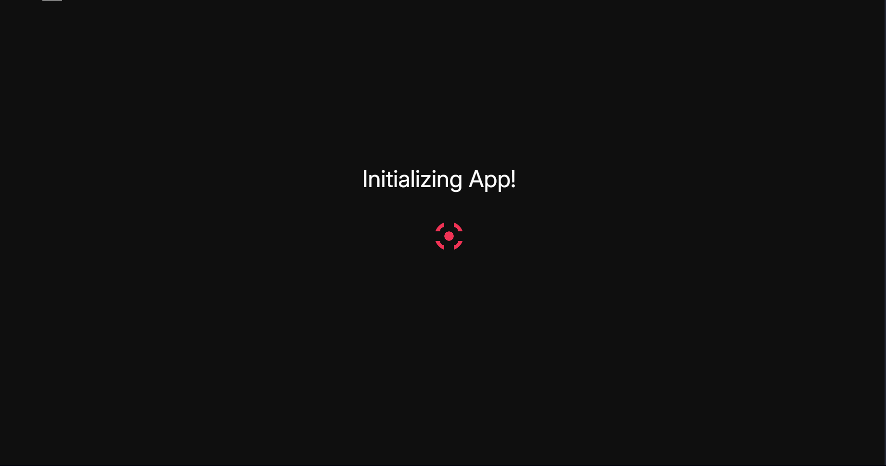
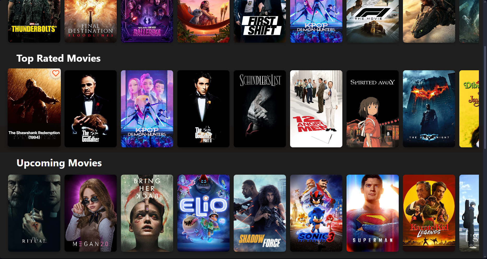
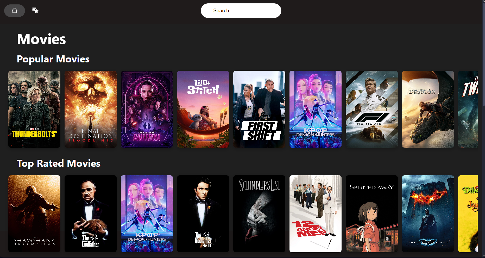
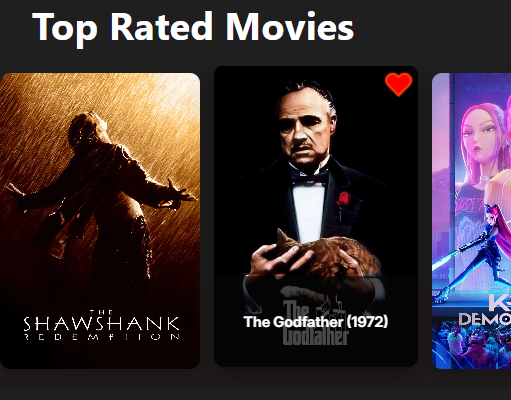
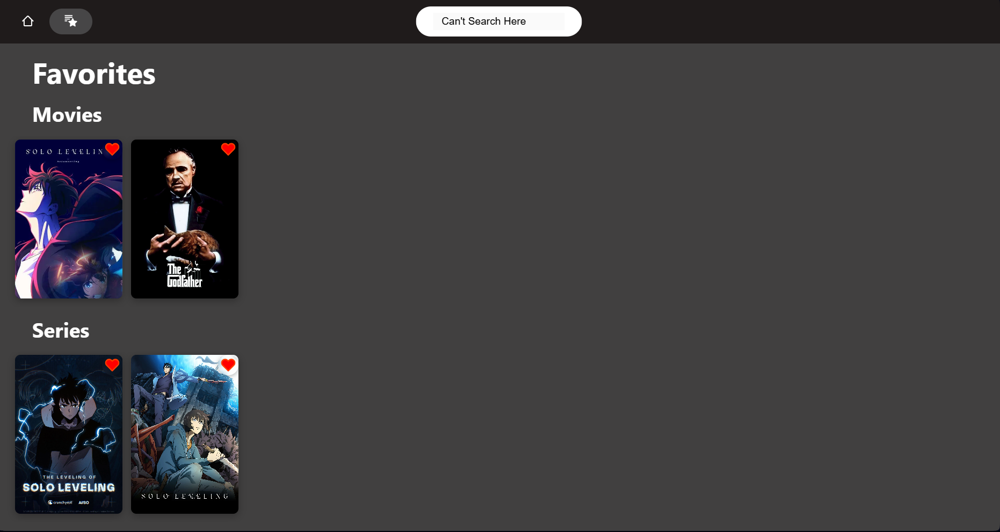

# 🎬 Maxol

A responsive and performant web application to discover, search, and favorite movies and TV series. Built with React and modern web APIs, Maxol integrates infinite scrolling, lazy loading, and optimized UX with minimal layout shifts.


---

## 🚀 Features

- 🔥 **Browse Popular, Top-Rated, and Upcoming** movies & series
- 🔍 **Search** by name for both movies and series
- ❤️ **Favorite** your top picks (Movies & Series)
- ♾️ **Infinite Scrolling** with Intersection Observer
- 🧠 **Lazy Loading** with `React.lazy()` and `Suspense`
- 🎯 **Performance-Optimized** (LCP: 0.68s, INP: 96ms)
- 🧩 **Minimal Layout Shift (CLS)** with pre-sized image containers
- 🎨 **Responsive Dark UI** using custom CSS and Flexbox
- 📦 Modular code with dedicated `api`, `dataLoaders`, and `components`

---

## 🛠 Built With

[![React][React.js]][React-url]
[![JavaScript][JavaScript]][JavaScript-url]
[![CSS3][CSS3]][CSS3-url]
[![Vite][Vite]][Vite-url]

---

## 🧠 Performance Metrics

| Metric                         | Value  | Status       |
|-------------------------------|--------|--------------|
| Largest Contentful Paint (LCP)| 0.68s  | ✅ Good       |
| Interaction to Next Paint (INP)| 96ms  | ✅ Excellent  |
| Cumulative Layout Shift (CLS) | 0.48   | ❌ Needs Fix  |

📌 *Work in progress: Reducing CLS using fixed image dimensions and skeleton loaders.*

---

## 📸 Screenshots

| Splash Screen | Movie Listings |
|:-------------:|:--------------:|
|  |  |

| Home View |
|:------------:|
|  |

| Liked Items | Favorites Page |
|:-----------:|:---------------:|
|  |  |

---

## 🧪 To Run Locally

```bash
git clone https://https://github.com/Bookinheaven/Maxol.git
cd Maxol
npm install
npm run dev
````

Make sure to replace the placeholder API keys (e.g., TMDB API key) inside your `api/apidb.js`.

---

## 💡 Future Improvements

* [ ] Add genre-based filtering and sorting
* [ ] Include series rating & release year filters
* [ ] Improve CLS with image placeholders or `react-loading-skeleton`
* [ ] Add trailer/video previews
* [ ] Add pagination toggle (manual & infinite scroll)

---

## 🔗 Acknowledgments

* 🌐 [TMDB API](https://www.themoviedb.org/documentation/api)
* 🎨 [React Icons](https://react-icons.github.io/react-icons/)
* ⚡ [Vite](https://vitejs.dev/)
* 📷 [Image Shields](https://shields.io/)

---

## 📜 License

This project is licensed under the [MIT License](LICENSE).

---

[React.js]: https://img.shields.io/badge/React-20232A?style=for-the-badge&logo=react&logoColor=61DAFB
[React-url]: https://reactjs.org/
[JavaScript]: https://img.shields.io/badge/JavaScript-F7DF1E?style=for-the-badge&logo=javascript&logoColor=black
[JavaScript-url]: https://developer.mozilla.org/en-US/docs/Web/JavaScript
[CSS3]: https://img.shields.io/badge/CSS3-1572B6?style=for-the-badge&logo=css3&logoColor=white
[CSS3-url]: https://developer.mozilla.org/en-US/docs/Web/CSS
[Vite]: https://img.shields.io/badge/Vite-646CFF?style=for-the-badge&logo=vite&logoColor=white
[Vite-url]: https://vitejs.dev
